# 🚗 Automated Vehicle Re-Identification & Temporal Matching System

[](https://www.python.org/downloads/)
[](https://pytorch.org/)
[](https://opencv.org/)
[](https://github.com/ultralytics/ultralytics)
[](LICENSE)

> A production-ready computer vision pipeline for matching vehicle entry/exit events using multi-engine OCR, fuzzy temporal matching, and optimized image enhancement strategies.

## 📋 Table of Contents
- [Overview](#overview)
- [System Architecture](#system-architecture)
- [Key Features](#key-features)
- [Technical Stack](#technical-stack)
- [Installation](#installation)
- [Usage](#usage)
- [Configuration](#configuration)
- [Project Structure](#project-structure)
- [Performance](#performance)
- [Testing](#testing)
- [License](#license)

## 🎯 Overview

This system automatically identifies and matches vehicle entry/exit events from a dataset of 2,000+ images by:
1. Extracting metadata and bounding boxes from cloud storage headers
2. Detecting and cropping license plates using computer vision
3. Running multi-strategy OCR with Fast-ALPR and EasyOCR fallback
4. Applying fuzzy string matching with temporal logic for entry/exit pairing

**Challenge Solved:** Given randomized vehicle images with no explicit pairing information, the system achieves **98.15% OCR accuracy** and **60.31% vehicle pairing rate** through intelligent enhancement strategies and temporal filtering.

## 🏗️ System Architecture

```mermaid
graph LR
    A[Image URLs] --> B[Metadata Extractor]
    B --> C[SQLite Database]
    C --> D[Plate Detection YOLOv8]
    D --> E[Plate Cropping]
    E --> F[Multi-Engine OCR]
    F --> G[Image Enhancement]
    G --> H[Fast-ALPR Primary]
    G --> I[EasyOCR Fallback]
    H --> J[Text Normalization]
    I --> J
    J --> K[Fuzzy Matcher]
    K --> L[Temporal Filter]
    L --> M[Greedy Pairing]
    M --> N[Submission Output]

    style F fill:#f9f,stroke:#333,stroke-width:2px
    style K fill:#bbf,stroke:#333,stroke-width:2px
    style M fill:#bfb,stroke:#333,stroke-width:2px
```



### Pipeline Stages

1. **Metadata Parsing** 🔍
   - Async HTTP HEAD requests (30 concurrent)
   - Extracts Last-Modified timestamps for temporal logic
   - Parses GCS metadata headers for bbox coordinates
   - 99.85% bbox extraction success rate

2. **License Plate Detection** 📸
   - YOLOv8 object detection for plates
   - Metadata bbox fallback (99.85% coverage)
   - ~115 images/second processing speed

3. **Multi-Engine OCR** 🔤
   - **Fast-ALPR** (Primary): Specialized ALPR with ONNX runtime
   - **EasyOCR** (Fallback): General-purpose OCR engine
   - **6-Strategy Enhancement**: CLAHE, sharpening, bilateral filtering, adaptive thresholding, morphological operations
   - Character normalization (0/O, 1/I, 8/B, 5/S)

4. **Fuzzy Temporal Matching** 🎯
   - Two-phase greedy algorithm:
     - Phase 1: Exact matches (100% similarity)
     - Phase 2: Fuzzy matches (75-99% similarity)
   - Temporal filtering (<72 hours between entry/exit)
   - Levenshtein distance with time proximity weighting

## ✨ Key Features

### 🎨 Multi-Strategy Image Enhancement
Applies 6 different enhancement techniques and selects the best OCR result:
- **CLAHE**: Contrast-limited adaptive histogram equalization
- **Sharpening**: Kernel-based edge enhancement
- **Bilateral**: Noise reduction while preserving edges
- **Adaptive Threshold**: Binarization for varying lighting
- **Morphological**: Closing operations for character connectivity

### 🧠 Intelligent Character Normalization
Handles common OCR ambiguities:
```python
character_mapping = {
    "0" ↔ "O",  # Zero and letter O
    "1" ↔ "I",  # One and letter I
    "8" ↔ "B",  # Eight and letter B
    "5" ↔ "S",  # Five and letter S
}
```

### ⏱️ Temporal Logic
- Timestamp-based filtering prevents incorrect matches
- Time proximity weighting: closer timestamps = higher confidence
- Configurable max time difference (default: 72 hours)

### 📊 Production-Grade Error Handling
- Async retry logic for network failures
- Database transaction rollbacks
- Comprehensive logging with levels (DEBUG, INFO, WARNING, ERROR)
- Graceful degradation (EasyOCR fallback if Fast-ALPR fails)

## 🛠️ Technical Stack

| Category | Technology |
|----------|-----------| 
| **Language** | Python 3.8+ |
| **Computer Vision** | OpenCV 4.8+, PIL |
| **Object Detection** | Ultralytics YOLOv8 |
| **Deep Learning** | PyTorch 2.0+, TorchVision |
| **OCR** | Fast-ALPR (ONNX), EasyOCR |
| **String Matching** | FuzzyWuzzy, python-Levenshtein |
| **Async I/O** | aiohttp, asyncio |
| **Database** | SQLite3 |
| **Configuration** | PyYAML |
| **Testing** | pytest, pytest-asyncio |

## 📦 Installation

### Prerequisites
- Python 3.8 or higher
- CUDA-capable GPU (optional, for faster inference)

### Setup

1. **Clone the repository**
```bash
git clone https://github.com/KPandya1903/FleetIQ.git
cd FleetIQ
```

2. **Create virtual environment**
```bash
python -m venv venv
source venv/bin/activate  # On Windows: venv\Scripts\activate
```

3. **Install dependencies**
```bash
pip install -r requirements.txt
```

## 🚀 Usage

### Quick Start

Run the complete pipeline:
```bash
python main.py --input vehicle_images_input.txt --output submission.txt
```

### Step-by-Step Execution

1. **Extract Metadata Only**
```bash
python main.py --phase metadata --input vehicle_images_input.txt
```

2. **Run OCR Extraction**
```bash
python main.py --phase ocr
```

3. **Perform Matching**
```bash
python main.py --phase matching
```

4. **Export Submission**
```bash
python main.py --phase export --output submission.txt
```

### Configuration

Edit `configs/config.yaml` to customize:
- OCR confidence thresholds
- Matching similarity thresholds
- Maximum time difference
- Image enhancement strategies
- Logging levels

Example:
```yaml
matching:
  min_similarity_threshold: 75
  max_time_difference_hours: 72

ocr:
  fast_alpr:
    confidence_threshold: 0.5
```

## 📁 Project Structure

```
FleetIQ/
├── src/                          # Source code
│   ├── data/                     # Data loading & metadata extraction
│   │   ├── __init__.py
│   │   └── metadata_extractor.py
│   ├── detection/                # YOLOv8 plate detection
│   │   └── __init__.py
│   ├── ocr/                      # Multi-engine OCR
│   │   ├── __init__.py
│   │   └── alpr_engine.py
│   ├── matching/                 # Fuzzy temporal matching
│   │   ├── __init__.py
│   │   └── vehicle_matcher.py
│   └── utils/                    # Utilities
│       ├── __init__.py
│       ├── config_loader.py
│       ├── logger.py
│       └── text_normalizer.py
├── configs/                      # Configuration files
│   └── config.yaml
├── tests/                        # Unit tests
│   ├── test_text_normalizer.py
│   └── test_matching.py
├── notebooks/                    # Jupyter notebooks (EDA, visualization)
├── assets/                       # Diagrams, screenshots
├── main.py                       # Main entry point
├── requirements.txt              # Python dependencies
├── .gitignore
├── LICENSE
└── README.md
```

## 📊 Performance Metrics

| Metric | Value |
|--------|-------|
| **Total Images** | 2,000 |
| **Bbox Extraction** | 99.85% (1,997/2,000) |
| **OCR Success Rate** | 98.15% (1,960/1,997) |
| **OCR Confidence (Avg)** | 87.8% |
| **Matched Pairs** | 591 |
| **Match Rate** | 60.31% of vehicles |
| **Avg Similarity** | 94.28% |
| **Avg Time Diff** | 6.35 hours |
| **Processing Speed** | ~115 images/sec (cropping) |

### OCR Breakdown
- Fast-ALPR (Optimized): 96.67% (1,896 plates)
- EasyOCR (Fallback): 3.27% (64 plates)

### Matching Breakdown
- Exact Matches: 368 pairs (100% similarity)
- Fuzzy Matches: 223 pairs (75-99% similarity)

## 🧪 Testing

Run unit tests:
```bash
pytest tests/ -v
```

Run with coverage:
```bash
pytest tests/ --cov=src --cov-report=html
```

## 📄 License

This project is licensed under the MIT License - see the [LICENSE](LICENSE) file for details.

## 🏆 Acknowledgments

- **Fast-ALPR**: Open-source ALPR library ([GitHub](https://github.com/ankandrew/fast-alpr))
- **Ultralytics YOLOv8**: State-of-the-art object detection
- **EasyOCR**: Robust general-purpose OCR engine

---

<p align="center">
  <i>Built with ❤️ for computer vision and intelligent systems</i>
</p>
